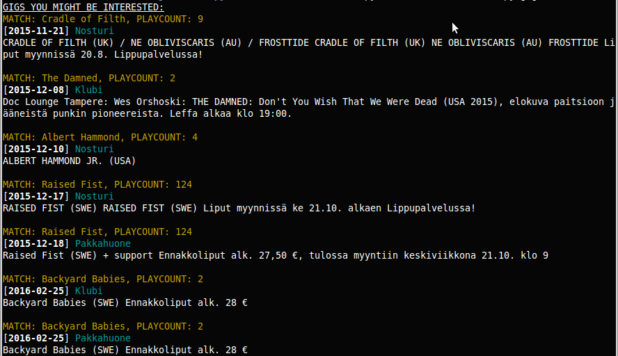

# BandEventNotifier
Notify incoming gigs regarding the listened artists on Last.FM.

## Motivation
I am a frequent visitor of live music performances.
At times I miss gigs I'd like to see.
Instead of using time to crawl through the venue pages as a weekly
routine and manually parsing all the interesting artist events, it's time to
automate this task.

Last.fm would have been excellent for this but it relies on users creating the
events.
Same applies for Facebook and other sites.
Instead of parsing all the interesting artist sites, I though it would be best
to parse venue programmes only.
Works for me (TM).

## Screenshot

## Dependencies
- Python 3.x
- venv
- pip3
- python-dev

## Setup
Activate venv and install needed packages:
	python3 -m venv BandEventNotifier
	cd BandEventNotifier
	. bin/activate
	pip3 install -r requirements.txt

Create `USERNAME` file under the repository and put our LastFM username in there:

	echo my-lastfm-username > USERNAME

Database won't get created automatically, yet, and therefore must be created
manually:

	$ sqlite3 bandevents.db < schema.sql

Now, fetch some data and enjoy!

	$ ./bandeventnotifier.py fetch

or to get usage information, just run `./bandeventnotifier.py`.

## Broken plugin
Venues site layouts changes every now and then.
That means a broken plugin.
One should sacrifice a few minutes to fix the issue but if you are in a hurry,
do the following:
	- Check the plugin's file name
	- Add broken plugin's file name into `plugin_handler.py` file
	- Variable is called `blacklisted`
	- i.e. `blacklisted = ["plugin_venuename"]`
	- Run the fetch again

Sometimes the domain dies and the plugin handler will go bonkers.
In that case, remove all the `*.pickle` files from `venues/` directory and
blacklist (and delete) the plugin.

If you are not capable to fix the plugin by yourself, please contact the author
of the plugin or me.

# LICENSE
Software is BSD Licensed, please see [LICENSE](LICENSE) for more info.

## TODO
- [ ] Change row\_factor to sqlite3.Row

- [ ] Sort plugins by Country/City/venuename

- [ ] Switch to SQL Alchemy

- [X] Improve (dev) documentation

- [X] Threaded fetcher for LastFM

- [X] Port to Python3

- [X] Better error handling for plugins

- [X] Fetch listening information from last.fm

- [X] Dynamic plugin loader for evenues

- [X] Design database

- [X] Implement threaded fetcher. Initializes plugins (venues) and stores
  fetched events into a database.

